# Лабораторная работа 1 – Docker

В этой лабораторной работе мы научимся базой работе с системой контейнеризации Docker.

# Что нужно сделать к защите

В лабораторной работе необходимо упаковать приложение в образ, загрузить его в реестр образов, после чего развернуть
контейнер на основе данного образа и контейнер с базой данных. Данные контейнеры должны находиться в одной сети.

Если вы знакомы с другими инструментами контейнеризации (например podman) – можно использовать их. В противном случае рекомендуется
использовать Docker.

К защите необходимо:

1. Иметь файл, позволяющий собирать образ с вашим приложением (Dockerfile);
2. Загрузить собранный образ в реестр (образ должен быть публичным и должен быть загружен на ваш аккаунт);
> Сделайте скрин загруженного образа! И положите рядом с докерфайлом, чтобы его было легко показать.
> Репозиторий должен быть публичным, а его название должно быть вида <номер группы>-<инициалы>, например, 1-rka.
3. Написать конфигурационный файл (docker-compose.yaml), в котором прописать поднятие двух контейнеров (один с вашим приложением, проброс
   порта 8080; другой с БД, проброс порта любой, внутри сети 5432);
4. Параметры конфигурации приложения (подключение к БД и порт, на котором оно запущено), должны браться из переменных окружения.

Лабу можно сделать на любом ЯП и с использованием любого приложения и БД. Если нет идей, что именно закинуть в образ - см. раздел ход
работы (ниже).

# Вопросы к защите

Я буду задавать вопросы (1-2) из списка, однако могу дополнительно спросить (исключительно) по содержанию практики.

Если ответить не получилось - в рамках того же занятия сможете освежить свои знания и подойти чуть позже.

1. Что такое контейнеризация? Как она упрощает развертывание и управление приложениями?
2. Что такое Docker и для чего он используется?
3. Что такое образ в Docker? Как собрать образ?
4. Что такое контейнер в Docker? Чем контейнер отличается от образа?
5. Что такое реестр контейнеров в Docker? Зачем он нужен?
6. Как отправить образ в реестр контейнеров?
7. Что такое docker-compose и в чем его преимущества?
8. Как docker-compose управляет сетевым взаимодействием между контейнерами?
9. Что такое проброс портов в Docker?

# Ход работы

В рамках лабораторной работы мы упакуем java приложение в образ, загрузим его в реестр,
а затем поднимем его вместе с БД используя docker-compose.

В рамках лабораторной работы будет использоваться Docker Desktop - GUI для докера.
Установить его можно [по этой ссылке](https://www.docker.com/products/docker-desktop/).

В образ мы будем упаковывать [вот это](https://drive.google.com/file/d/1sRiAPQtPhOhqv5kP73XllRC6H0xF_chJ/view?usp=sharing)
тестовое приложение. Это простое клиент-серверное приложение,
которое при отправке GET запроса на /api/v1/get залогирует его и выведет все запросы, сделанные ранее.

Для создания образа с нашим приложением нам потребуется написать Dockerfile. В нем мы укажем, на основе какого образа собираем наш образ
(это будет образ с JDK), какие файлы в него попадут, а также какую команду он выполнит при
старте.

Идейно в наш образ должно попасть наше приложение (jar файл), а стартовать он должен с запуска этого приложения (то есть с команды java
-jar <наш файл>.jar).

Работать мы будем в терминале в папке со структурой, показанной на скриншоте ниже

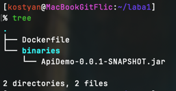

То есть в нашей рабочей директории будет находиться файл `Dockerfile`, а файл, помещаемый в образ, будет лежать в папке `binaries`.

Отлично, теперь давайте наполним наш `Dockerfile`:

```dockerfile
FROM eclipse-temurin:17-jdk
COPY binaries/*.jar app.jar
ENV SERVER_PORT=8080
ENTRYPOINT ["java", "-jar", "app.jar"]
```

Директива `FROM` говорит, на основе какого образа мы собираем наш (в данном случае это образ с openjdk 17);
директива `COPY` копирует наш бинарный файл в рабочую директорию внутри образа (в нашем случае это /) и называет его `app.jar`;
директива `ENV` устанавливает значение для переменных окружения, а `ENTRYPOINT` указывает, с какой команды будет стартовать контейнер
(в нашем случае это `java -jar app.jar`, то есть запуск нашего приложения).

Подробнее об остальных директивах можно прочитать [в документации](https://docs.docker.com/reference/dockerfile/#overview).

Собрать из данного докерфайла образ можно командой `docker build`:

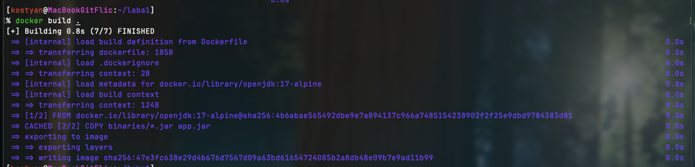

Видим, что наш образ был собран. Найти его ID можно с помощью команды `docker images` - собранный образ будет в самом начале списка.

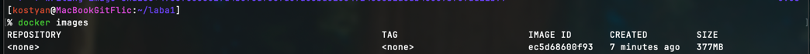

Запустить образ можно командой `docker container run -p 8080:8080 <id образа>` - эта команда запустит контейнер и пробросит порт 8080 из контейнера на
localhost (то есть при подключении к localhost:8080 вы будете на самом деле общаться с контейнером). 

Запускать образ мы пока не будем, для его работы нужна БД, ее мы подключим чуть позже. Давайте запушим наш образ на Docker Hub - официальный реестр контейнеров docker.

Для этого нам нужно зарегистрироваться [вот здесь](https://app.docker.com/signup).

После чего необходимо создать репозиторий (сделать это можно [по этой ссылке](https://hub.docker.com/repository/create)). 

> Репозиторий должен быть публичным, а его название должно быть вида <номер группы>-<инициалы>, например, 1-rka.

После создания репозитория нам необходимо переименовать наш образ. Сделать это можно командой `docker image tag <id образа> <новое название>`.

Новое название должно соответствовать вашему репозиторию, а это <имя-пользователя>/<название>.

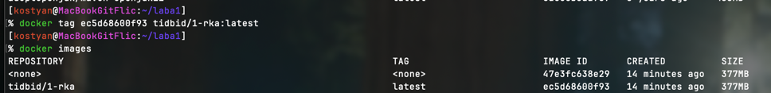

В моем случае название образа будет `tidbid/1-rka`. В дополнении к названию (репозиторию) образа можно еще и указать его тег, условно говоря, версию образа. 
Я использовал тег `latest` - он подставляется по умолчанию и указывает на последнюю версию образа.

Супер, теперь давайте пушить образ. Для этого нам сначала потребуется выполнить команду `docker login` и ввести логин и пароль от реестра.

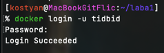

Обратите внимание, при вводе пароля вводимые символы не отображаются (в целях безопасности)!

Теперь все готово к тому, чтобы мы выполнили команду `docker push <название_образа:тег>`. Давайте так и сделаем:

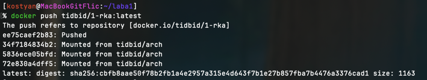

Супер, образ запушился, информация о нем появилась в реестре.

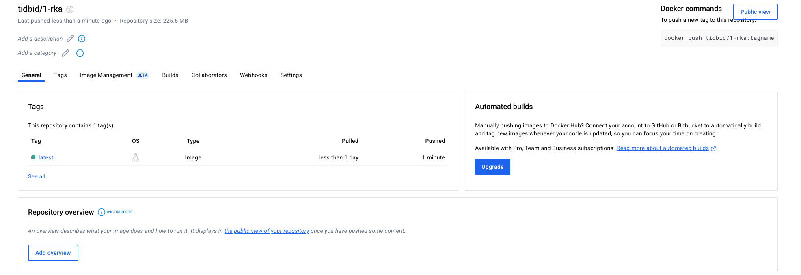

Теперь наш образ может скачать любой пользователь Docker Hub - супер крутая история. 
Давайте наконец настроим наше приложение, чтобы оно нормально работало. 

Для этого нам нужно поднять БД и указать параметры подключения к ней. Контейнеризация - невероятно удобная история, поэтому давайте и БД поднимем в отдельном контейнере.

Однако для общения двух наших контейнеров (БД и приложения) необходимо настроить общую сеть, а также прокинуть параметры конфигурации при запуске контейнеров. Это неудобно, давайте лучше используем Docker compose.

Docker compose это инструмент, позволяющий управлять конфигурацией контейнеров с помощью конфигурационных файлов, а не параметров, передаваемых в команду `docker run`. Также docker compose облегачает многоконтейнерные развертывания, 
автоматически конфигурируя сеть между ними.

Давайте напишем простой `docker-compose.yaml` (положим его рядом в папку compose рядом с докерфайлом), именно этот файл и будет использоваться в качестве конфигурационного:

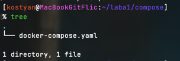


Наполним наш `docker-compose.yaml`:

```yaml
services:
  api-demo:
    image: tidbid/1-rka
    environment:
      SPRING_DATASOURCE_URL: "jdbc:postgresql://postgres:5432/default"
      SPRING_DATASOURCE_USERNAME: "postgres"
      SPRING_DATASOURCE_PASSWORD: "postgres"
    ports:
      - "8080:8080"
    restart: always
    depends_on: 
       - postgres

  postgres:
    image: postgres:13.3
    environment:
      POSTGRES_DB: "default"
      POSTGRES_USER: "postgres"
      POSTGRES_PASSWORD: "postgres"
      PGDATA: "/var/lib/postgresql/data/pgdata"
    ports:
      - "8001:5432"
    volumes:
      - .:/var/lib/postgresql/data
    restart: always
```

Мы указали два сервиса: наше приложение и БД. Также мы указали какие образы будут использоваться для сервисов (`image`, для первого наш образ, для второго - образ постгреса); значения переменных (поле `environment`) окружения (в них параметры подключения к бд);
прописали проброс портов (`ports`), а также `volumes` для контейнера с БД, который позволит нам не терять данные при перезапуске контейнера.

Подробнее про параметры `docker-compose.yaml` можно узнать из [документации](https://docs.docker.com/reference/compose-file/).

Давайте запустим наш compose командой `docker compose up -d`:

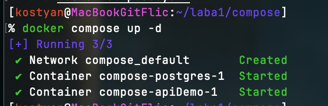

Отлично, контейнеры запустились, что видно в docker desktop:

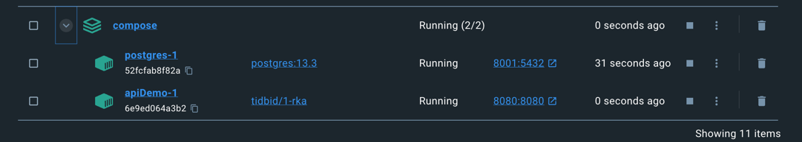

> Приложение запустится, как только поднимется база, за это отвечает атрибут `depends_on` в сервисе `api-demo`.

После того как все запустилось, давайте проверим работоспособность нашего прилжения:

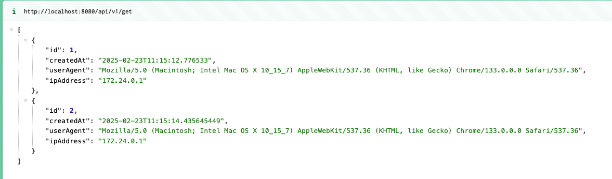

Видим, что все работает.

Если вдруг нам понадобится что-то сделать изнутри контейнера, то попасть в него можно с помощью команды `docker container exec -it <ID/имя контейнера> <название оболочки>`, например:

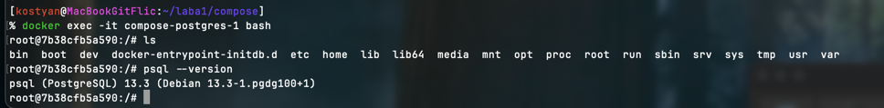

Видим, что мы зашли в контейнер с постгресом.
