# Лабораторная работа 2 – Кэширование (Redis)

В этой лабораторной работе мы научимся базовой работе с in-memory key-value хранилищем Redis (будем использовать его open-source форк KeyDB).

# Что нужно сделать к защите

В лабораторной работе необходимо поднять KeyDB, выполнить базовые операции с ним с помощью keydb-cli, а также подключить KeyDB в ваше
приложение
с использованием API библиотеки и применить его для написания кэширования данных.

К защите необходимо:

1. Иметь поднятый KeyDB (например, через docker-compose);
2. С помощью keydb-cli создать:
    1. Строковое значение по ключу `student:{ваша_группа}:{номер_в_списке}` значение - `{ваше ФИО}`;
    2. HASH по ключу `student:{ваша_группа}:{номер_в_списке}:info` значение - поле `name` - `{ваше ФИО}`; поле `age` - `{ваш возраст}`; поле
       `email` - `{ваш .misis.edu email}`;
    3. LIST по ключу `student:{ваша_группа}:{номер_в_списке}:timetable` значение - список названий пар в любой день (значений должно быть
       больше 1);
    4. SET по ключу `student:{ваша_группа}:{номер_в_списке}:skills` значение - любые технологии, с которыми вы знакомы (например, `Docker`,
       `Java`);
    5. ZSET по ключу `student:{ваша_группа}:{номер_в_списке}:tasks_w_priority` значение - список любых задач с приоритетом - чем он выше,
       тем выше приоритет задачи (например, `Сделать лабу 1` `100`; `Сделать лабу 2` `150`)
> Сохраните вывод команды (выполняйте ее вне keydb-cli/redis-cli, просто в терминале контейнера/локально):
> ```
> CURSOR=0
> while [ "$CURSOR" -ne 0 ]; do
> read -r CURSOR_OUT KEYS_OUT from $(redis-cli SCAN "$CURSOR")
> CURSOR=$CURSOR_OUT
>    for key in $KEYS_OUT; do
>        type=$(redis-cli TYPE "$key")
>        echo "Key: $key, Type: $type"
>        case "$type" in
>             string) redis-cli GET "$key";;
>             hash) redis-cli HGETALL "$key";;
>             list) redis-cli LRANGE "$key" 0 -1;;
>             set) redis-cli SMEMBERS "$key";;
>             zset) redis-cli ZRANGE "$key" 0 -1 WITHSCORES;;
>        esac
>    done
> done
> ```
> В выводе команды должны быть видны данные, которые вы создавали в рамках описанных пунктов.
3. Уметь выполнять все базовые операции с данными значениями (вставка в лист, удаление из сета, просмотр значения в HASH и т.д.), а также
   уметь устанавливать, просматривать, сбрасывать время жизни ключей (TTL).
4. Добавить в ваше приложение (или в то, которое указано в `Ход работы`) логику `cache-aside` с применением API библиотеки для Redis (она будет полностью совместима с keydb).
   Кешировать необходимо данные из БД, *должна быть продемонстрирована логика чтения из кеша и удаления данных из него при их
   изменении*.
5. Ваше итоговое приложение должно быть загружено в GitHub/GitLab/GitFlic

Лабу можно сделать на любом ЯП.

# Вопросы к защите

Я буду задавать вопросы (1-2) из списка, однако могу дополнительно спросить (исключительно) по содержанию практики.

Если ответить не получилось - в рамках того же занятия сможете освежить свои знания и подойти чуть позже.

1. Что такое кэширование и зачем оно используется?
2. Какие стратегии кэширования существуют?
3. Какие стратегии вытеснения кэша существуют?
4. Что такое и зачем используется Redis (KeyDB)?
5. Какие есть основные типы данных в Redis (KeyDB)?
6. Как можно взаимодействовать с Redis (KeyDB)?
7. Используя ключ со списком значений из п.2.3 добавьте новое значение в начало списка, отобразите все значения списка, только первое,
   удалите значение
   из списка. Какая асимптотика данных операций?
8. Используя ключ со строковым значением из п.2.1 получите данное значение, замените его на любое другое строковое значение. Какая
   асимптотика данных операций?
9. Используя ключ с HASH из п.2.2 выведите все поля хэша, выведите поле `name`, поменяйте значение поля `name` на произвольное. Какая
   асимптотика данных операций?
10. Используя ключ с SET из п.2.4 выведите все элементы сета, попробуйте добавить новый элемент, попробуйте добавить дублирующийся элемент,
   удалите добавленный элемент. Какая асимптотика данных операций?
11. Используя ключ с ZSET из п.2.5 выведите все элементы и их веса, получите элемент с наибольшим весом, добавьте элемент с весом 0, сделайте
   вес этого элемента 100, удалите данный элемент. Какая асимптотика данных операций?
12. Как реализуетя работа с Redis (KeyDB) в вашем приложении?
13. Как реализуется стратегия `cache-aside` в вашем приложении? Когда применение данной стратегии обосновано?

# Ход работы

В рамках лабораторной работы мы познакомимся с in-memory key-value хранилищем Redis
(будем использовать его open-source форк KeyDB, который полностью совместим с API Redis). Реализуем с помощью данного хранилища
`cache-aside` кеширование в простом `CRUD` приложении.

Давайте начнем наше знакомство с установки KeyDB, сделаем это через `Docker`. Используем следующий `docker-compose.yaml`:

```yaml
version: "3"
services:
  keydb:
    image: "eqalpha/keydb:x86_64_v5.3.3"
    container_name: keydb
    command: "keydb-server /etc/keydb/redis.conf --server-threads 2"
    volumes:
#      - "./redis.conf:/etc/keydb/redis.conf"
      - "data:/data"
    ports:
      - "6379:6379"
    restart: unless-stopped

volumes:
  data:
    driver: local
```

После его поднятия командой `docker compose up -d` по `localhost:6379` будет доступен инстанс KeyDB.

Для подключения к нему перейдем в контейнер командой `docker exec -it keydb bash` и выполним вызов `keydb-cli` 
(имя нашего контейнера - `keydb`, если у вас оно отличается, необходимо изменить команду):

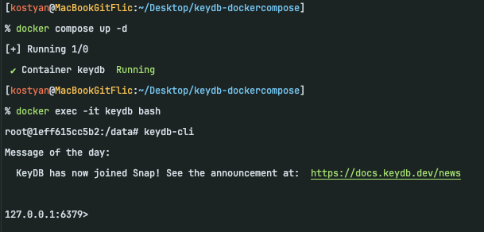

`keydb-cli` - утилита командной строки для работы с KeyDB. Ее можно установить локально и тогда переходить в контейнер будет необязательно.

Давайте начнем с создания и чтения простой пары ключ-значение:

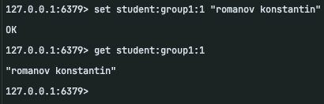

Команды `SET` и `GET` позволяют установить и прочитать значение по ключу. Теперь в нашем хранилище лежит значение `romanov konstantin` по ключу `student:group1:1`.

Значение это будет лежать бесконечно, пока мы его не удалим - давайте установим ему время жизни (TTL), после которого оно будет из хранилища удалено.

Время жизни устанавливается командой `EXPIRE` которая принимает в себя ключ и время его жизни в секундах:

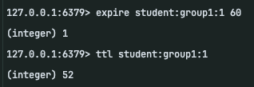

Команда `TTL` позволяет просмотреть оставшееся время жизни ключа. Видим, что TTL был установлен, а на момент запроса ключу осталось жить 52 секунды.

Чтобы снова сделать ключ постоянным, можно воспользоваться командой `PERSIST`:

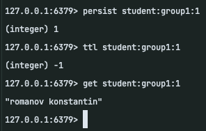

Видим, что теперь время жизни ключа не ограничено.

Отлично! Теперь давайте переходить к более сложным структурам.

Создадим HASH - словарь, который позволит ассоциировать с ключом сразу несколько пар ключ-значение. 
В нем можно хранить структурированные данные, например, о пользователе вашего сервиса:

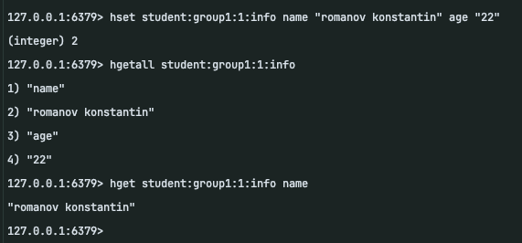

Команда `HSET` принимает в себя ключ, а также набор пар ключ-значение которые будут установлены по данному ключу.

Читать данные пары можно по отдельности (с помощью команды `HGET`), а можно сразу все (с помощью команды `HGETALL`).

Для хранения списка значений можно воспользоваться типом данных `LIST`:

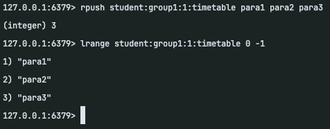

Для вставки элементов в список можно использовать команды `LPUSH` и `RPUSH` для вставки в начало/конец списка соответственно. Для чтения
элементов списка существует команда `LRANGE` принимающая в себя индекс начала и конца вывода (индексация начинается с нуля, можно в качестве индекса использовать 
отрицательный, тогда индексация будет с конца начиная с -1 (последний элемент)). То есть, чтобы вывести все элементы списка необходимо указать `LRANGE {key} 0 -1`, 
чтобы только последний - `LRANGE {key} -1 -1`.

Для удаления элементы из списка существуют команды `LPOP` и `RPOP`:

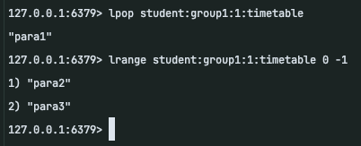

Теперь рассмотрим `SET` - список уникальных значений.

Для работы с данным типом данных используются команды `SADD`; `SREM`; `SMEMBERS` и `SISMEMBER`:

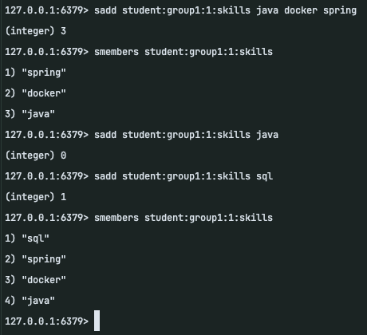

Сет не допускает дублирующихся элементов, поэтому добавить в него `java` второй раз - не получилось.

Далее рассмотрим `ZSET` - упорядоченное множество элементов. Здесь ключу соответствует множество значений, каждое из которых имеет свой вес.
Значения упорядочены по возрастанию веса.

Создадим такое множество:

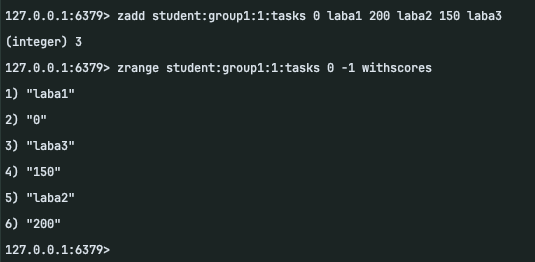

Видим, что при добавлении элемента сначала указывается вес, потом - значение.

Для получения значений используется команда `ZRANGE`. Чтобы получить значение с наибольшим весом, необходимо указать в качестве индексов `-1 -1`:

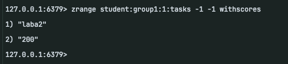

Для удаления значения можно использовать команду `ZREM`, а для изменения веса - `ZINCRBY` (прибавляет к весу указанное значение):

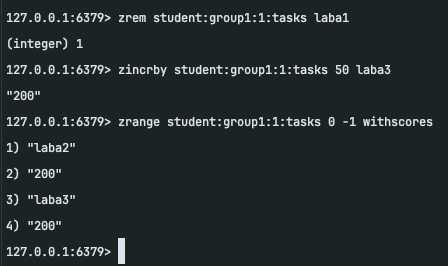

Удалить ключ из хранилища можно двумя командами - `DEL` (удаляет синхронно) и `UNLINK` (удаляет асинхронно, подходит для больших значений):

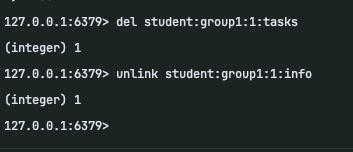

В конце зафиксируем то, что создали:
> Сохраните вывод команды (выполняйте ее вне keydb-cli/redis-cli, просто в терминале контейнера/локально):
> ```
> CURSOR=0
> while [ "$CURSOR" -ne 0 ]; do
> read -r CURSOR_OUT KEYS_OUT from $(redis-cli SCAN "$CURSOR")
> CURSOR=$CURSOR_OUT
>    for key in $KEYS_OUT; do
>        type=$(redis-cli TYPE "$key")
>        echo "Key: $key, Type: $type"
>        case "$type" in
>             string) redis-cli GET "$key";;
>             hash) redis-cli HGETALL "$key";;
>             list) redis-cli LRANGE "$key" 0 -1;;
>             set) redis-cli SMEMBERS "$key";;
>             zset) redis-cli ZRANGE "$key" 0 -1 WITHSCORES;;
>        esac
>    done
> done
> ```
> В выводе команды должны быть видны данные, которые вы создавали в рамках работы с редисом.

Отлично, мы познакомились с базовой работой через `keydb-cli`, давайте перейдем к использованию KeyDB в качестве кеширующего сервиса!

В качестве примера добавим `cache-aside` кэширование к простому CRUD приложению для работы с пользователями. 
[Репозиторий доступен по ссылке](https://github.com/tidbid-kt/archapp).

Рекомендую вам [сделать форк данного проекта](https://docs.github.com/en/pull-requests/collaborating-with-pull-requests/working-with-forks/fork-a-repo) и работать уже с ним.

В `dockercompose/docker-compose.yaml` уже указаны все сервисы, необходимые для нашего приложения (дополнительно там прописан `keydb` из прошлого примера).

Для работы с данным проектом рекомендую использовать IDE `IntellijIDEA` ([скачать ее можно по этой ссылке, нужна впнка](https://www.jetbrains.com/idea/download)). 

Для работы с KeyDB в наше приложение надо подключить соответствующий API клиент. Воспользуемся библиотекой `spring-boot-starter-data-redis`, она позволяет
взаимодействовать с Redis через `RedisTemplate` - удобную абстракцию над `Redis API`.

Для начала модифицируем файл `pom.xml` в папке `user-service`, добавив в секцию `<dependencies>...</dependencies>` следующую зависимость:

```xml
        <dependency>
            <groupId>org.springframework.boot</groupId>
            <artifactId>spring-boot-starter-data-redis</artifactId>
        </dependency>
```

Дальше добавим параметры подключения к нашему `keydb` в `user-service/src/resources/application.properties`:

```properties
spring.data.redis.host=localhost
spring.data.redis.port=6379
spring.data.redis.database=0
```

Здесь мы указываем, что подключение будет к `localhost:6379`; к бд под номером 0. Если приложение (user-service) разворачивается в контейнере - значение хоста необходимо будет изменить.

Теперь добавим класс `RedisConfiguration` в папку `user-service/src/main/java/com/misis/archapp/configuration`, именно в нем мы сконфигурируем наш `RedisTemplate`:

```java
package com.misis.archapp.user.configuration;

import org.springframework.context.annotation.Bean;
import org.springframework.context.annotation.Configuration;
import org.springframework.data.redis.connection.RedisConnectionFactory;
import org.springframework.data.redis.core.RedisTemplate;
import org.springframework.data.redis.serializer.GenericJackson2JsonRedisSerializer;
import org.springframework.data.redis.serializer.RedisSerializer;

@Configuration
public class RedisConfiguration {

    @Bean
    public RedisTemplate<String, Object> redisTemplate(RedisConnectionFactory redisConnectionFactory) {
        GenericJackson2JsonRedisSerializer serializer = new GenericJackson2JsonRedisSerializer();

        RedisTemplate<String, Object> template = new RedisTemplate<>();
        template.setConnectionFactory(redisConnectionFactory);
        template.setValueSerializer(serializer);
        template.setDefaultSerializer(serializer);
        template.setHashKeySerializer(serializer);
        template.setKeySerializer(RedisSerializer.string());

        return template;
    }

}

```

Отлично, теперь мы можем написать кэширующий сервис, именно в нем будет логика работы непосредственно с кэшем. Его API будет отдавать только методы
взятия/удаления/сохранения конкретной информации из кэша.

Реализуем его в виде класса `UserCacheService` который поместим в папку `user-service/src/main/java/com/misis/archapp/service/cache`:

```java
package com.misis.archapp.user.service.cache;

import com.misis.archapp.user.dto.UserDTO;
import java.time.Duration;
import java.util.Optional;
import java.util.UUID;
import org.springframework.beans.factory.annotation.Autowired;
import org.springframework.data.redis.core.RedisTemplate;
import org.springframework.stereotype.Service;

@Service
public class UserCacheService {

    private final RedisTemplate<String, Object> redisTemplate;

    @Autowired
    public UserCacheService(RedisTemplate<String, Object> redisTemplate) {
        this.redisTemplate = redisTemplate;
    }

    private static final String CACHE_PREFIX = "user:v1:";
    private static final Duration TTL = Duration.ofSeconds(60);

    public Optional<UserDTO> getFromCache(UUID id) {
        return Optional.ofNullable((UserDTO) redisTemplate.opsForValue().get(CACHE_PREFIX + id));
    }

    public void saveToCache(UserDTO user) {
        redisTemplate.opsForValue().set(CACHE_PREFIX + user.id(), user, TTL);
    }

    public void removeFromCache(UUID id) {
        redisTemplate.delete(CACHE_PREFIX + id);
    }

}
```

Данный сервис позволит нам кэшировать `UserDTO` между запросами. В этом есть смысл, так как изменение информации о пользователях - не такая частая операция. 
`TTL` для наших данных установлен на 60 секунд, то есть после 60 секунд информация о пользователе из кэша будет удалена.

Используем наш сервис для реализации стратегии кэширования `cache-aside`.

Для этого требуется реализовать следующую логику: при запросе пользователя проверять, есть ли он в кэше; если есть - забирать оттуда, если нет - идти в БД и обновлять данные в кэше. 
При удалении/обновлении пользователя данные из кэша необходимо очищать.

Схема работы кэша:

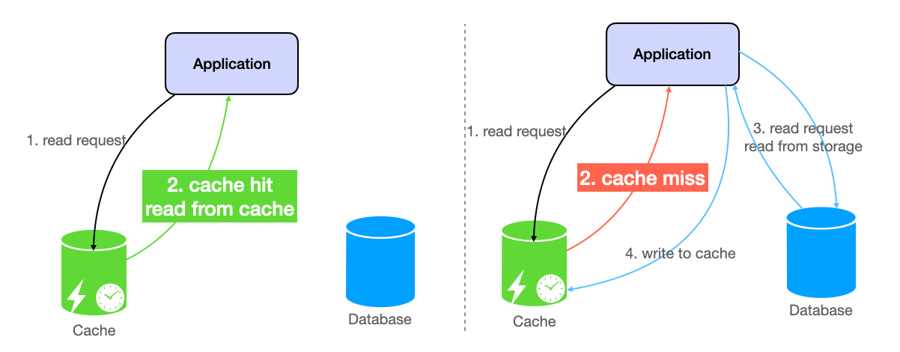

Поместить данную логику логичнее всего в `UserService`, изменим данный класс следующим образом:

```java
package com.misis.archapp.user.service;

import com.misis.archapp.user.db.User;
import com.misis.archapp.user.db.UserRepository;
import com.misis.archapp.user.dto.UserCreateDTO;
import com.misis.archapp.user.dto.UserDTO;
import com.misis.archapp.user.dto.UserUpdateDTO;
import com.misis.archapp.user.dto.mapper.UserMapper;
import com.misis.archapp.user.service.cache.UserCacheService;
import java.util.List;
import java.util.Optional;
import java.util.UUID;
import org.slf4j.Logger;
import org.slf4j.LoggerFactory;
import org.springframework.beans.factory.annotation.Autowired;
import org.springframework.http.HttpStatus;
import org.springframework.stereotype.Service;
import org.springframework.web.server.ResponseStatusException;

@Service
public class UserService {

    private static final Logger LOGGER = LoggerFactory.getLogger(UserService.class);

    private final UserRepository userRepository;
    private final UserMapper userMapper;
    private final UserCacheService userCacheService;

    @Autowired
    public UserService(
        UserRepository userRepository,
        UserMapper userMapper,
        UserCacheService userCacheService
    ) {
        this.userRepository = userRepository;
        this.userMapper = userMapper;
        this.userCacheService = userCacheService;
    }

    public List<UserDTO> getAllUsers() {
        return userMapper.toDTOList(userRepository.findAll());
    }

    public UserDTO getUserById(UUID id) {
        Optional<UserDTO> cachedUser = userCacheService.getFromCache(id);

        // cache hit - нашел пользователя в кэше
        //noinspection OptionalIsPresent
        if (cachedUser.isPresent()) {
            LOGGER.info("User cache hit");
            return cachedUser.get();
        }

        LOGGER.info("User cache miss");
        // cache miss - пользователя в кэше не оказалось
        UserDTO userFromDB = userRepository.findById(id).map(userMapper::toDTO)
            .orElseThrow(() -> new ResponseStatusException(HttpStatus.NOT_FOUND));

        // актуализирует кэш значением из БД
        userCacheService.saveToCache(userFromDB);
        return userFromDB;
    }

    public UserDTO createUser(UserCreateDTO userCreateDTO) {
        User user = userMapper.toEntity(userCreateDTO);
        User savedUser = userRepository.save(user);
        return userMapper.toDTO(savedUser);
    }

    public UserDTO updateUser(UUID id, UserUpdateDTO userUpdateDTO) {
        User user = userRepository.findById(id)
            .orElseThrow(() -> new ResponseStatusException(HttpStatus.NOT_FOUND));

        if (userUpdateDTO.name().isPresent()) {
            user.setName(userUpdateDTO.name().get());
        }

        if (userUpdateDTO.email().isPresent()) {
            user.setEmail(userUpdateDTO.email().get());
        }

        User savedUser = userRepository.save(user);

        // после обновления - очищает данные из кэша
        LOGGER.info("User cache evict on update");
        userCacheService.removeFromCache(user.getId());

        return userMapper.toDTO(savedUser);
    }

    public void deleteUser(UUID id) {
        userRepository.deleteById(id);
        // после удаления - очищает данные из кэша
        LOGGER.info("User cache evict on delete");
        userCacheService.removeFromCache(id);
    }

}
```

Отлично, теперь при вызове метода `getUserById` сначала происходит проверка данных в кэше, если их там нет - приложение идет в БД. При этом 
для обеспечения согласованности данных между кэшем и БД при удалении/изменении пользователя кэш принудительно очищается. Таким образом мы реализовали
паттерн `cache-aside`.

Запустим наше приложение и проверим, что все работает. После запуска перейдем на http://localhost:8080/swagger-ui/index.html:

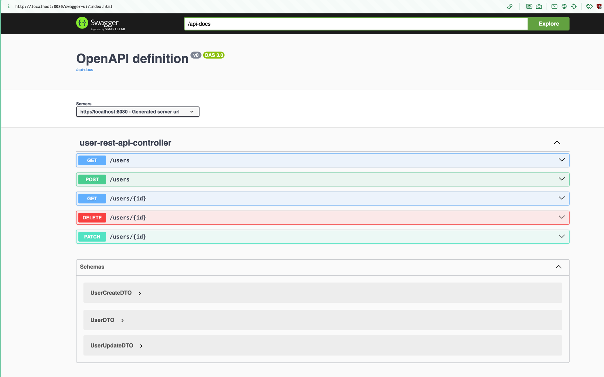

Создадим нашего пользователя:

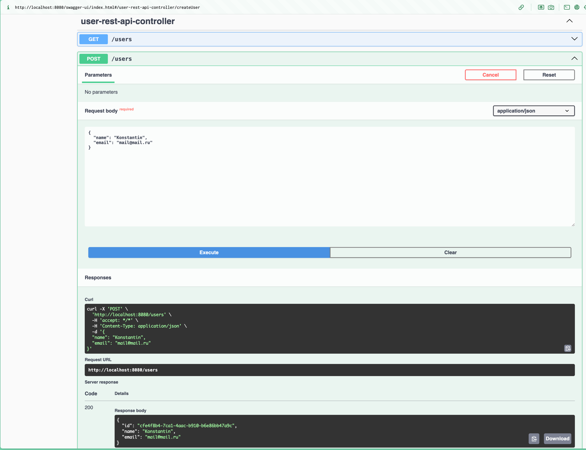

После чего два раза запросим данные по его UUID:

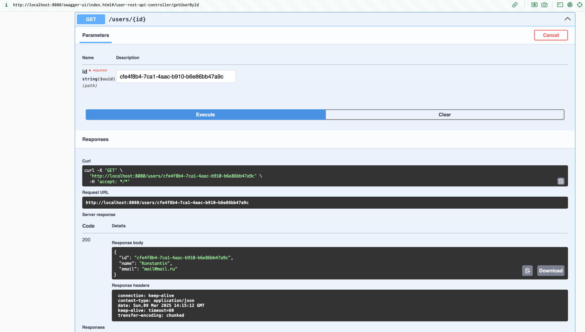

В логах приложения видим следующее:

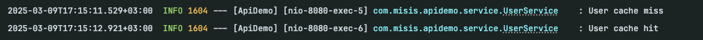

То есть при первом запросе пользователь был взят из БД и положен в кэш. При втором - взят из кэша. 

Наше `cache-aside` кэширование работает! 

Самостоятельно предлагаю проверить `TTL` нашего кэша (что через 60 секунд после первого запроса данные из кэша пропадут),
а также его инвалидацию при обновлении/удалении пользователя :)

