# Лабораторная работа 5 – CQRS и Event Sourcing

В этой лабораторной работе мы рассмотрим на практическом примере реализацию архитектурных паттернов
CQRS (Command Query Responsibility Segregation) и Event Sourcing.

# Что нужно сделать к защите

В лабораторной работе необходимо реализовать сервис по принципам CQRS (разделение API на чтение и запись) и
Event Sourcing.

К защите необходимо:

1. Реализовать сервис по паттерну CQRS:
    1. Принимать как минимум две различные команды (Command);
    2. Чтение данных через запросы (Query);
    3. Разделить классы, DTO, контроллеры и репозитории для write/read моделей.
    4. Разделение должно быть четко видно в API сервиса.
2. В сервис, реализованный по паттерну CQRS, добавить Event Sourcing:
    1. При обработке команд должны генерироваться события, описывающие факт изменения;
    2. Изменения состояния бизнес сущностей должны храниться в Event Store в виде неизменяемой последовательности событий;
    3. Read-модели должны быть реализованы на основе событий в виде проекций (как минимум одна модель).
    4. Read-модели обязаны создаваться только из событий, не параллельно событиям при их отправке (!).

Лабораторная работа может быть выполнена на любом ЯП.

# Вопросы к защите

1. Что означает паттерн CQRS и зачем он применяется?
2. В чём разница между write-side и read-side в CQRS?
3. Какие преимущества и недостатки у архитектуры CQRS?
4. Что такое Event Sourcing и как он отличается от традиционного хранения состояния?
5. Какие преимущества даёт Event Sourcing в контексте аудита?
6. Почему события в Event Sourcing не должны изменяться после записи?
7. Как можно восстановить агрегат в Event Sourcing?
8. Что такое snapshot и зачем он используется?
9. Что такое replay событий и в каких случаях он применяется?
10. Какие команды реализованы в вашем сервисе и что они делают?
11. Как строятся read-модели в вашем сервисе?
12. Где хранятся события в вашем сервисе (что выступает в качестве `Event store`)?

# Ход работы

В данной лабораторной работе будем реализовывать `balance-service` - сервис по работе с балансом пользователя.
Именно его функционал будет обеспечен используя паттерны CQRS + Event Sourcing.

Данный сервис добавлен в `main` ветку репозитория в данном
коммите: https://github.com/tidbid-kt/archapp/commit/f4519b051424259a292bcb063c94d12774cea414.

Вы можете повторить диффы, либо выполнить следующую команду в корне вашего git репозитория с лабами:

```bash
git fetch https://github.com/tidbid-kt/archapp.git main && \
git cherry-pick f4519b051424259a292bcb063c94d12774cea414
```

Для реализации данных паттернов будем использовать Axon framework.

Давайте добавим его в наш `dockercompose/docker-compose.yaml`:

```yaml
services:
  balance-service:
    build:
      context: ../balance-service
      dockerfile: Dockerfile
    container_name: balance-service-lab5
    environment:
      SPRING_RABBITMQ_HOST: 'rabbitmq'
      SPRING_DATASOURCE_URL: 'jdbc:postgresql://balance-db:5432/balance-db'
      AXON_AXONSERVER_SERVERS: 'axonserver:8124'
    networks:
      - balance-net
      - shared-net
    ports:
      - "8081:8080"
    depends_on:
      - balance-db
      - rabbitmq
    restart: unless-stopped

  balance-db:
    image: postgres:13.3
    container_name: balance-db-lab5
    networks:
      - balance-net
    environment:
      POSTGRES_DB: "balance-db"
      POSTGRES_USER: "postgres"
      POSTGRES_PASSWORD: "postgres"
    volumes:
      - ./balance-db-data:/var/lib/postgresql/data
    restart: unless-stopped

  user-service:
    build:
      context: ../user-service  # Указывает на корень проекта, где находится директория user-service
      dockerfile: Dockerfile  # Путь к Dockerfile в директории user-service
    container_name: user-service-lab5
    environment:
      SPRING_DATA_REDIS_HOST: 'user-keydb'
      SPRING_RABBITMQ_HOST: 'rabbitmq'
      SPRING_DATASOURCE_URL: 'jdbc:postgresql://user-db:5432/apidemo-db'
    networks:
      - user-net
      - shared-net
    ports:
      - "8080:8080"
    depends_on:
      - user-keydb
      - user-db
      - rabbitmq
    restart: unless-stopped

  user-db:
    image: postgres:13.3
    container_name: user-db-lab5
    environment:
      POSTGRES_DB: "apidemo-db"
      POSTGRES_USER: "postgres"
      POSTGRES_PASSWORD: "postgres"
      PGDATA: "/var/lib/postgresql/data/pgdata"
    networks:
      - user-net
    volumes:
      - ./user-db-data:/var/lib/postgresql/data
    restart: unless-stopped

  user-keydb:
    image: "eqalpha/keydb:x86_64_v5.3.3"
    container_name: user-keydb-lab5
    command: "keydb-server /etc/keydb/redis.conf --server-threads 2"
    networks:
      - user-net
    volumes:
      - "./keydb-data:/data"
    restart: unless-stopped

  notification-service:
    build:
      context: ../notification-service  # Указывает на корень проекта, где находится директория user-service
      dockerfile: Dockerfile  # Путь к Dockerfile в директории user-service
    container_name: notification-service-lab5
    networks:
      - shared-net
    environment:
      SPRING_RABBITMQ_HOST: rabbitmq
    depends_on:
      - rabbitmq
    restart: unless-stopped

  axonserver:
    image: axoniq/axonserver
    container_name: axonserver-lab5
    ports:
      - "8024:8024"   # HTTP UI (dashboard, queries)
      - "8124:8124"   # gRPC (для приложений)
    volumes:
      - ./axon-data:/axonserver/data
      - ./axon-events:/axonserver/events
      - ./axon-config:/axonserver/config
    environment:
      AXONIQ_AXONSERVER_NAME: axonserver
      AXONIQ_AXONSERVER_HOSTNAME: axonserver
      AXONIQ_AXONSERVER_DEVMODE_ENABLED: true
    restart: unless-stopped
    networks:
      - shared-net

  rabbitmq:
    image: "rabbitmq:3-management"
    container_name: rabbitmq-lab5
    networks:
      - shared-net
    ports:
      - "5672:5672"
      - "15672:15672"
      - "15692:15692"  # По этому порту Prometheus может получить метрики
    environment:
      RABBITMQ_DEFAULT_USER: guest
      RABBITMQ_DEFAULT_PASS: guest
      RABBITMQ_SERVER_ADDITIONAL_ERL_ARGS: "-rabbitmq_prometheus true" # Включает плагин для отдачи метрик
    volumes:
      - ./rabbitmq-data:/var/lib/rabbitmq
    restart: unless-stopped

  # Сервис Prometheus
  prometheus:
    image: prom/prometheus:v2.44.0
    container_name: prometheus-archapp-lab5
    networks:
      - shared-net
    ports:
      - "9090:9090"   # Prometheus web UI
    volumes:
      - ./prometheus.yml:/etc/prometheus/prometheus.yml  # Конфигурационный файл
      - ./alert_rules.yml:/etc/prometheus/alert_rules.yml  # Файл с алертами
    restart: unless-stopped

  # Сервис Grafana
  grafana:
    image: grafana/grafana
    container_name: grafana-lab5
    networks:
      - shared-net
    ports:
      - "3000:3000"   # Grafana web UI
    environment:
      - GF_SECURITY_ADMIN_PASSWORD=admin  # Пароль администратора
    volumes:
      - grafana-data:/var/lib/grafana
    depends_on:
      - prometheus  # Дожидается прометея
    restart: unless-stopped

  # Сервис Alertmanager
  alertmanager:
    image: prom/alertmanager:v0.24.0
    container_name: alertmanager-lab5
    networks:
      - shared-net
    ports:
      - "9093:9093"   # Alertmanager web UI
    volumes:
      - ./alertmanager.yml:/etc/alertmanager/alertmanager.yml  # Конфигурационный файл
    restart: unless-stopped

  # Тестовый SMTP сервер
  mailpit:
    image: axllent/mailpit
    container_name: mailpit-lab5
    networks:
      - shared-net
    ports:
      - "1025:1025"  # SMTP
      - "8025:8025"  # Web UI
    restart: unless-stopped

volumes:
  grafana-data:

networks:
  user-net: # сеть для user-service и его БД + keyDb
  balance-net: # сеть для balance-service и его БД
  shared-net: # общая сеть для сервисов, rabbitmq, prometheus и т.д.
```

Мы добавили `axonserver` - именно он поможет нам реализовать ES в нашем приложении. А также разделили
сервисы по сетям - `user-net` для сервисов по работе с пользователем, `balance-net` - для сервисов по работе с балансом.
А также общая сеть - `shared-net`. Она нужна чтобы сервисы в общем контуре могли коммуницировать друг с другом.

Подключим его в зависимости нашего проекта.

Для начала необходимо добавить следующую зависимость в `pom.xml` в корне проекта:

```xml
<dependency>
    <groupId>org.axonframework</groupId>
    <artifactId>axon-spring-boot-starter</artifactId>
    <version>4.9.1</version>
</dependency>
```

Далее добавим эту же зависимость уже в наш модуль, по пути `balance-service/pom.xml`:

```xml

<dependency>
    <groupId>org.axonframework</groupId>
    <artifactId>axon-spring-boot-starter</artifactId>
</dependency>
```

Отлично, зависимость подключили, давайте писать код.

Для начала напишем команды, которые будет принимать наш сервис. Их будет всего три:

Команда `balance-service/src/main/java/com/misis/archapp/balance/command/CreateBalanceCommand.java` отвечает за команду по созданию нового
баланса:

```java
package com.misis.archapp.balance.command;

import java.util.UUID;
import org.axonframework.modelling.command.TargetAggregateIdentifier;

public record CreateBalanceCommand(@TargetAggregateIdentifier UUID userId) {
}
```

Команда `balance-service/src/main/java/com/misis/archapp/balance/command/CreditBalanceCommand.java` отвечает за команду по добавлению денег
на баланс:

```java
package com.misis.archapp.balance.command;

import java.math.BigDecimal;
import java.util.UUID;
import org.axonframework.modelling.command.TargetAggregateIdentifier;

public record CreditBalanceCommand(
    @TargetAggregateIdentifier UUID userId,
    BigDecimal amount
) {
}
```

Команда `balance-service/src/main/java/com/misis/archapp/balance/command/DebitBalanceCommand.java` отвечает за команду по снятию денег с
баланса:

```java
package com.misis.archapp.balance.command;

import java.math.BigDecimal;
import java.util.UUID;
import org.axonframework.modelling.command.TargetAggregateIdentifier;

public record DebitBalanceCommand(
    @TargetAggregateIdentifier UUID userId,
    BigDecimal amount
) {
}
```

Команды написали, теперь давайте укажем события, которые генерируются после выполнения команд.

Событий тоже будет три, каждое соответствует своей команде:

`balance-service/src/main/java/com/misis/archapp/balance/event/BalanceCreatedEvent.java` - баланс был создан:

```java
package com.misis.archapp.balance.event;

import java.util.UUID;

public record BalanceCreatedEvent(UUID userId) {
}
```

`balance-service/src/main/java/com/misis/archapp/balance/event/BalanceCreditedEvent.java` - на баланс были положены деньги:

```java
package com.misis.archapp.balance.event;

import java.math.BigDecimal;
import java.util.UUID;
import org.axonframework.serialization.Revision;

@Revision("1")
public record BalanceCreditedEvent(UUID userId, BigDecimal amount) {
}
```

`balance-service/src/main/java/com/misis/archapp/balance/event/BalanceDebitedEvent.java` - с баланса были сняты деньги:

```java
package com.misis.archapp.balance.event;

import java.math.BigDecimal;
import java.util.UUID;
import org.axonframework.serialization.Revision;

@Revision("1")
public record BalanceDebitedEvent(
    UUID userId,
    BigDecimal amount
) {
}
```

Далее давайте напишем агрегат, над которым будут выполняться команды.
Агрегат — это объект, инкапсулирующий бизнес-правила, контролирующий, какие изменения допустимы,
и гарантирующий целостность данных внутри себя.

Класс `balance-service/src/main/java/com/misis/archapp/balance/command/model/BalanceAggregate.java` будет выглядеть следующим образом:

```java
package com.misis.archapp.balance.command.model;

import com.misis.archapp.balance.command.CreateBalanceCommand;
import com.misis.archapp.balance.command.CreditBalanceCommand;
import com.misis.archapp.balance.command.DebitBalanceCommand;
import com.misis.archapp.balance.event.BalanceCreatedEvent;
import com.misis.archapp.balance.event.BalanceCreditedEvent;
import com.misis.archapp.balance.event.BalanceDebitedEvent;
import java.math.BigDecimal;
import java.util.UUID;
import org.axonframework.commandhandling.CommandHandler;
import org.axonframework.eventsourcing.EventSourcingHandler;
import org.axonframework.modelling.command.AggregateIdentifier;
import org.axonframework.modelling.command.AggregateLifecycle;
import org.axonframework.spring.stereotype.Aggregate;

@Aggregate
public class BalanceAggregate {

    @AggregateIdentifier
    private UUID userId;
    private BigDecimal balance = BigDecimal.ZERO;

    protected BalanceAggregate() {
    }

    // хендлер - конструктор, через эту команду агрегат создается
    @CommandHandler
    public BalanceAggregate(CreateBalanceCommand cmd) {
        AggregateLifecycle.apply(new BalanceCreatedEvent(cmd.userId()));
    }

    // данный хендлер работает с уже существующим агрегатом
    @CommandHandler
    public void handle(CreditBalanceCommand cmd) {
        if (cmd.amount().compareTo(BigDecimal.ZERO) <= 0)
            throw new IllegalArgumentException("Amount must be > 0");

        AggregateLifecycle.apply(new BalanceCreditedEvent(cmd.userId(), cmd.amount()));
    }

    // данный хендлер работает с уже существующим агрегатом
    @CommandHandler
    public void handle(DebitBalanceCommand cmd) {
        if (cmd.amount().compareTo(balance) > 0)
            throw new IllegalStateException("Insufficient funds");

        AggregateLifecycle.apply(new BalanceDebitedEvent(cmd.userId(), cmd.amount()));
    }

    @EventSourcingHandler
    public void on(BalanceCreatedEvent e) {
        this.userId = e.userId();
        this.balance = BigDecimal.ZERO;
    }

    @EventSourcingHandler
    public void on(BalanceCreditedEvent e) {
        this.balance = balance.add(e.amount());
    }

    @EventSourcingHandler
    public void on(BalanceDebitedEvent e) {
        this.balance = balance.subtract(e.amount());
    }
}
```

Видим, что в агрегате объявлены методы получения команд и проверки инварианта (того, что выполнение команды не нарушит состояние нашего
агрегата),
а также методы `on`, в которых происходит применение ивентов к агрегату.

Состояние агрегата хранится именно в виде последовательности ивентов - сначала создания, а затем набора добавления и снятия денег с баланса.

Чтение состояния агрегата происходит через Query модели. За их формирование отвечает еще одна сущность - `Projector`.

Давайте напишем сущности, которые будет формировать `Projector` путем обработки ивентов.

Первая сущность `balance-service/src/main/java/com/misis/archapp/balance/query/BalanceHistoryEntry.java` будет представлять собой
лог изменения баланса пользователя:

```java
package com.misis.archapp.balance.query;

import jakarta.persistence.Entity;
import jakarta.persistence.GeneratedValue;
import jakarta.persistence.Id;
import java.math.BigDecimal;
import java.time.Instant;
import java.util.UUID;

@Entity
public class BalanceHistoryEntry {

    @Id
    @GeneratedValue
    private Long id;
    private UUID userId;
    private String type;
    private BigDecimal amount;
    private Instant timestamp;

    public Long getId() {
        return id;
    }

    public UUID getUserId() {
        return userId;
    }

    public BalanceHistoryEntry setUserId(UUID userId) {
        this.userId = userId;
        return this;
    }

    public String getType() {
        return type;
    }

    public BalanceHistoryEntry setType(String type) {
        this.type = type;
        return this;
    }

    public BigDecimal getAmount() {
        return amount;
    }

    public BalanceHistoryEntry setAmount(BigDecimal amount) {
        this.amount = amount;
        return this;
    }

    public Instant getTimestamp() {
        return timestamp;
    }

    public BalanceHistoryEntry setTimestamp(Instant timestamp) {
        this.timestamp = timestamp;
        return this;
    }
}
```

Добавим также репозиторий для работы с ней (класс
`balance-service/src/main/java/com/misis/archapp/balance/query/BalanceHistoryRepository.java`):

```java
package com.misis.archapp.balance.query;

import java.util.List;
import java.util.UUID;
import org.springframework.data.jpa.repository.JpaRepository;
import org.springframework.stereotype.Repository;

@Repository
public interface BalanceHistoryRepository extends JpaRepository<BalanceHistoryEntry, Long> {
    List<BalanceHistoryEntry> findAllByUserId(UUID userId);
}
```

Далее добавим сущность, которая будет отображать текущую сумму на балансе пользователя (класс
`balance-service/src/main/java/com/misis/archapp/balance/query/BalanceView.java`):

```java
package com.misis.archapp.balance.query;

import jakarta.persistence.Entity;
import jakarta.persistence.Id;
import java.math.BigDecimal;
import java.util.UUID;

@Entity
public class BalanceView {

    @Id
    private UUID userId;
    private BigDecimal balance;

    public UUID getUserId() {
        return userId;
    }

    public BalanceView setUserId(UUID userId) {
        this.userId = userId;
        return this;
    }

    public BigDecimal getBalance() {
        return balance;
    }

    public BalanceView setBalance(BigDecimal balance) {
        this.balance = balance;
        return this;
    }
}
```

И репозиторий для работы с ней (класс `balance-service/src/main/java/com/misis/archapp/balance/query/BalanceViewRepository.java`):

```java
package com.misis.archapp.balance.query;

import java.util.UUID;
import org.springframework.data.jpa.repository.JpaRepository;
import org.springframework.stereotype.Repository;

@Repository
public interface BalanceViewRepository extends JpaRepository<BalanceView, UUID> {
}
```

Отлично, с тем, как будут выглядеть наши read-модели мы определились, давайте писать проекцию.

Класс `balance-service/src/main/java/com/misis/archapp/balance/query/projection/BalanceProjection.java` проекции будет выглядеть следующим
образом:

```java
package com.misis.archapp.balance.query.projection;

import com.misis.archapp.balance.event.BalanceCreatedEvent;
import com.misis.archapp.balance.event.BalanceCreditedEvent;
import com.misis.archapp.balance.event.BalanceDebitedEvent;
import com.misis.archapp.balance.query.BalanceHistoryEntry;
import com.misis.archapp.balance.query.BalanceHistoryRepository;
import com.misis.archapp.balance.query.BalanceView;
import com.misis.archapp.balance.query.BalanceViewRepository;
import jakarta.persistence.EntityNotFoundException;
import java.math.BigDecimal;
import java.time.Instant;
import org.axonframework.eventhandling.EventHandler;
import org.springframework.beans.factory.annotation.Autowired;
import org.springframework.stereotype.Component;

@Component
public class BalanceProjection {

    private final BalanceViewRepository balanceViewRepository;
    private final BalanceHistoryRepository balanceHistoryRepository;

    @Autowired
    public BalanceProjection(
        BalanceViewRepository balanceViewRepository,
        BalanceHistoryRepository balanceHistoryRepository
    ) {
        this.balanceViewRepository = balanceViewRepository;
        this.balanceHistoryRepository = balanceHistoryRepository;
    }

    @EventHandler
    public void on(BalanceCreatedEvent e) {
        BalanceView view = new BalanceView().setUserId(e.userId()).setBalance(BigDecimal.ZERO);
        balanceViewRepository.save(view);

        // вносит запись о событии в историю
        BalanceHistoryEntry historyEntry =
            new BalanceHistoryEntry()
                .setUserId(e.userId())
                .setType("CREATE")
                .setAmount(BigDecimal.ZERO)
                .setTimestamp(Instant.now());
        balanceHistoryRepository.save(historyEntry);
    }

    @EventHandler
    public void on(BalanceCreditedEvent e) {
        // меняет состояние read-модели баланса пользователя - добавляет деньги
        BalanceView view = balanceViewRepository.findById(e.userId()).orElseThrow(EntityNotFoundException::new);
        view.setBalance(view.getBalance().add(e.amount()));
        balanceViewRepository.save(view);

        // вносит запись о событии в историю
        BalanceHistoryEntry historyEntry =
            new BalanceHistoryEntry()
                .setUserId(e.userId())
                .setType("CREDIT")
                .setAmount(e.amount())
                .setTimestamp(Instant.now());
        balanceHistoryRepository.save(historyEntry);
    }

    @EventHandler
    public void on(BalanceDebitedEvent e) {
        // меняет состояние read-модели баланса пользователя - забирает деньги
        BalanceView view = balanceViewRepository.findById(e.userId()).orElseThrow(EntityNotFoundException::new);
        view.setBalance(view.getBalance().subtract(e.amount()));
        balanceViewRepository.save(view);

        // вносит запись о событии в историю
        BalanceHistoryEntry historyEntry =
            new BalanceHistoryEntry()
                .setUserId(e.userId())
                .setType("DEBIT")
                .setAmount(e.amount())
                .setTimestamp(Instant.now());
        balanceHistoryRepository.save(historyEntry);
    }

}
```

Видим, что проекция обрабатывает все типы ивентов и для каждого из них соответсвующим образом меняет read-модели.

Например, для ивента кредитования баланса она увеличивает текущий счет `BalanceView` и добавляет новое вхождение об операции с типом
`CREDIT`
в `BalanceHistory`.

Таким образом читаемые данные можно восстановить, просто переиграв все события, произошедшие с агрегатом.

Отлично, основная бизнес логика написана, давайте сделаем контроллеры и протестируем, что все работает как надо.

Контроллеров будет два, один для работы с командами, а второй - с запросами.

Контроллер для команд (класс `balance-service/src/main/java/com/misis/archapp/balance/api/BalanceCommandController.java`):

```java
package com.misis.archapp.balance.api;

import com.misis.archapp.balance.command.CreateBalanceCommand;
import com.misis.archapp.balance.command.CreditBalanceCommand;
import com.misis.archapp.balance.command.DebitBalanceCommand;
import java.math.BigDecimal;
import java.util.UUID;
import java.util.concurrent.CompletableFuture;
import org.axonframework.commandhandling.gateway.CommandGateway;
import org.springframework.beans.factory.annotation.Autowired;
import org.springframework.web.bind.annotation.PathVariable;
import org.springframework.web.bind.annotation.PostMapping;
import org.springframework.web.bind.annotation.RequestBody;
import org.springframework.web.bind.annotation.RequestMapping;
import org.springframework.web.bind.annotation.RestController;

@RestController
@RequestMapping("/balances")
public class BalanceCommandController {
    private final CommandGateway gateway;

    @Autowired
    public BalanceCommandController(
        CommandGateway gateway
    ) {
        this.gateway = gateway;
    }

    @PostMapping("/{userId}/create")
    public CompletableFuture<String> create(@PathVariable UUID userId) {
        return gateway.send(new CreateBalanceCommand(userId));
    }

    @PostMapping("/{userId}/credit")
    public CompletableFuture<Void> credit(@PathVariable UUID userId, @RequestBody BigDecimal amount) {
        return gateway.send(new CreditBalanceCommand(userId, amount));
    }

    @PostMapping("/{userId}/debit")
    public CompletableFuture<Void> debit(@PathVariable UUID userId, @RequestBody BigDecimal amount) {
        return gateway.send(new DebitBalanceCommand(userId, amount));
    }
}
```

Контроллер для запросов на чтение (класс `balance-service/src/main/java/com/misis/archapp/balance/api/BalanceQueryController.java`):

```java
package com.misis.archapp.balance.api;

import com.misis.archapp.balance.query.BalanceHistoryEntry;
import com.misis.archapp.balance.query.BalanceHistoryRepository;
import com.misis.archapp.balance.query.BalanceView;
import com.misis.archapp.balance.query.BalanceViewRepository;
import java.util.List;
import java.util.UUID;
import org.springframework.beans.factory.annotation.Autowired;
import org.springframework.http.ResponseEntity;
import org.springframework.web.bind.annotation.GetMapping;
import org.springframework.web.bind.annotation.PathVariable;
import org.springframework.web.bind.annotation.RequestMapping;
import org.springframework.web.bind.annotation.RestController;

@RestController
@RequestMapping("/balances")
public class BalanceQueryController {
    private final BalanceViewRepository viewRepo;
    private final BalanceHistoryRepository historyRepo;

    @Autowired
    public BalanceQueryController(
        BalanceViewRepository viewRepo,
        BalanceHistoryRepository historyRepo
    ) {
        this.viewRepo = viewRepo;
        this.historyRepo = historyRepo;
    }

    @GetMapping("/{userId}")
    public ResponseEntity<BalanceView> getBalance(@PathVariable UUID userId) {
        return viewRepo.findById(userId)
            .map(ResponseEntity::ok)
            .orElse(ResponseEntity.notFound().build());
    }

    @GetMapping("/{userId}/history")
    public List<BalanceHistoryEntry> getHistory(@PathVariable UUID userId) {
        return historyRepo.findAllByUserId(userId);
    }
}
```

Супер! Почти все. Однако есть небольшая проблема, если событий над агрегатом становится слишком много, то восстановление его состояния при,
например, построении новой read-модели, начинает занимать слишком много времени.

Чтобы это исправить существует механика снапшоттинга (snapshotting) - по накоплению определенного числа событий
состояние агрегата фиксируется, для его получения больше не нужно пробегаться по прошлым событиям.

Axon делает снапшоттинг по умолчанию, однако давайте сконфигурируем его до более низкого порога, чтобы посмотреть, как он работает.

Для этого напишем конфигурационный класс `balance-service/src/main/java/com/misis/archapp/balance/AxonConfig.java`:

```java
package com.misis.archapp.balance;

import org.axonframework.eventsourcing.EventCountSnapshotTriggerDefinition;
import org.axonframework.eventsourcing.SnapshotTriggerDefinition;
import org.axonframework.eventsourcing.Snapshotter;
import org.springframework.context.annotation.Bean;
import org.springframework.context.annotation.Configuration;

@Configuration
public class AxonConfig {

    @Bean
    public SnapshotTriggerDefinition snapshotTrigger(Snapshotter snapshotter) {
        return new EventCountSnapshotTriggerDefinition(snapshotter, 10);
    }

}
```

Теперь снапшоттинг будет происходить после 10 событий.

Ну, теперь точно все, давайте проверять. Сначала соберем наш проект через мавен:

Делаем сначала `clean`:

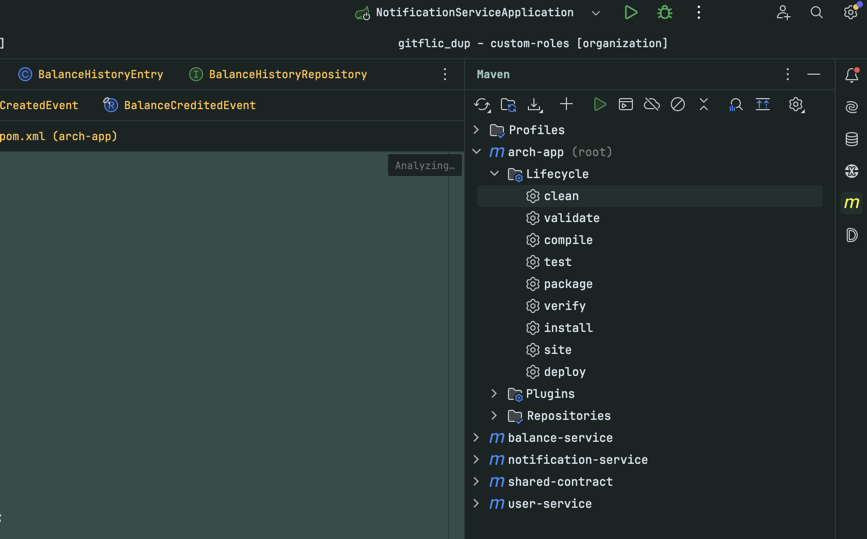

Затем `install`:

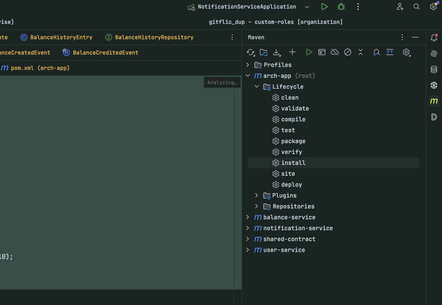

После успешной сборки запускаем контейнеры командой `docker compose up --build -d` (вы должны находиться в папке `dockercompose`):

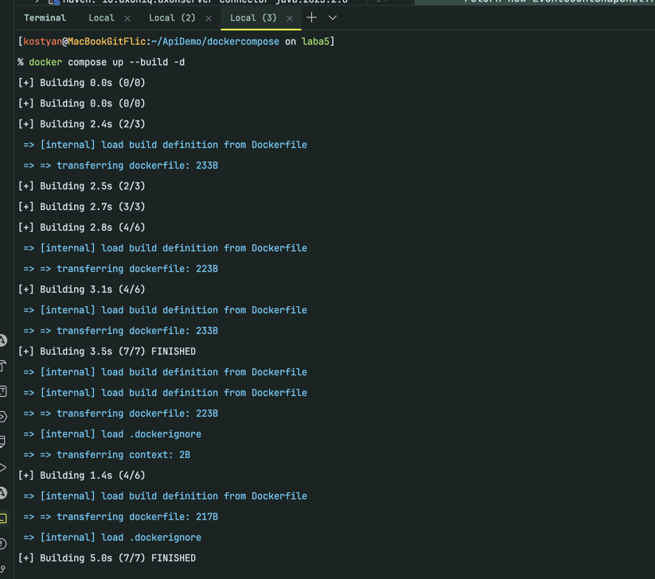

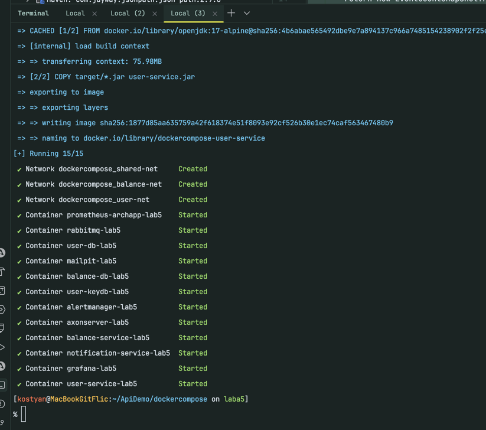

> Если при запуске user-service/balance-service возникает ошибка SQLSTATE 28P01 -
> выполните команду
> ```bash
> git fetch https://github.com/tidbid-kt/archapp.git hotfix/h2 && \
> git cherry-pick 1cba0156361706e6b07d7092c46a3996c1f75421
> ```
> И удалите переменные окружения SPRING_DATASOURCE_URL из docker-compose.yaml (в двух местах, для user-service и balance-service)

Отлично, контейнеры запустились, теперь давайте перейдем в браузере на урл `localhost:8024`. Именно там находится админ-панель
`axon-server`. Именно это решение используется в качестве `event-bus` и `event-store` для нашего приложения.

Итак, в браузере увидим следующее (если там пусто, подождите около 60 секунд, может быть сервер еще не поднялся):

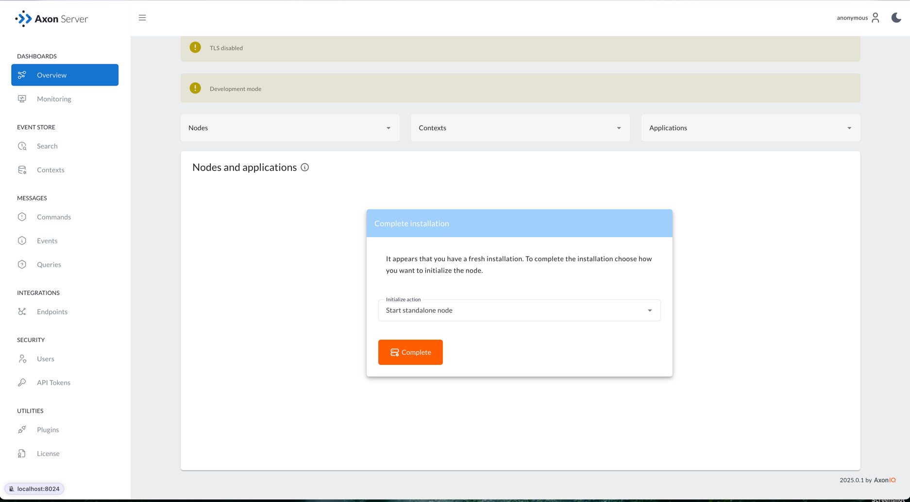

Выберем опцию `Start standalone node` и нажмем на кнопку:

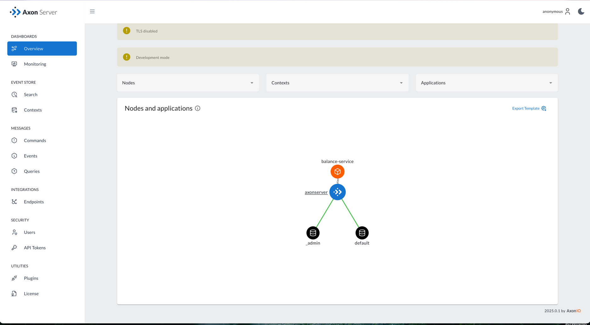

Увидим, что наш сервис успешно подключился к аксону.

Теперь перейдем по урл `localhost:8081/swagger-ui/index.html` и увидем следующее:

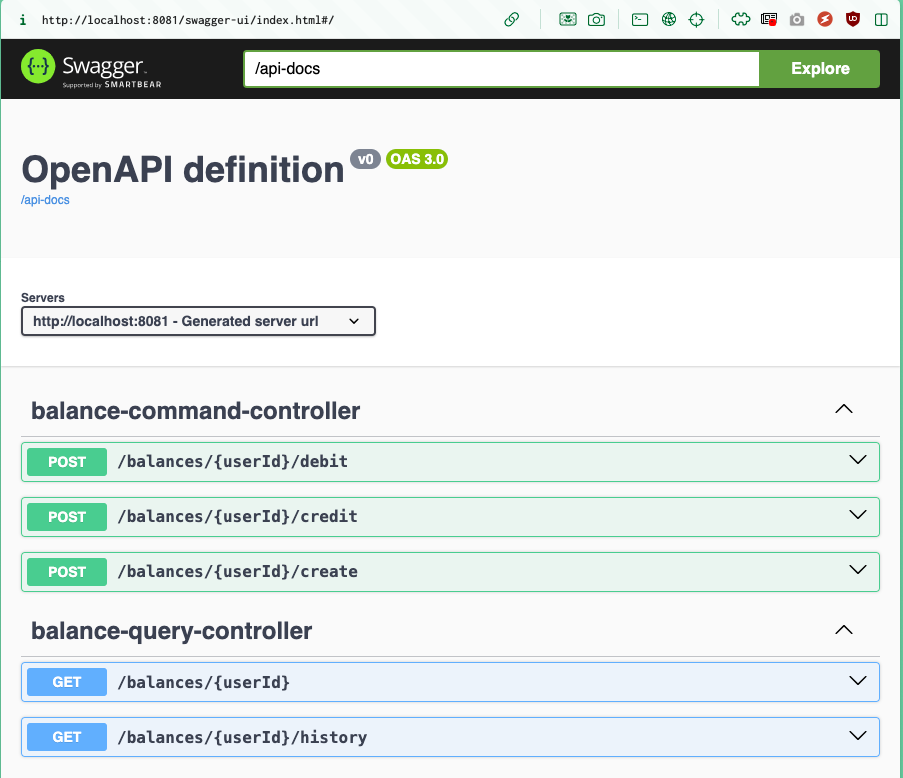

Давайте создадим баланс для пользователя с ID `5a955866-3a68-4fae-b117-87a972dd9a46`:

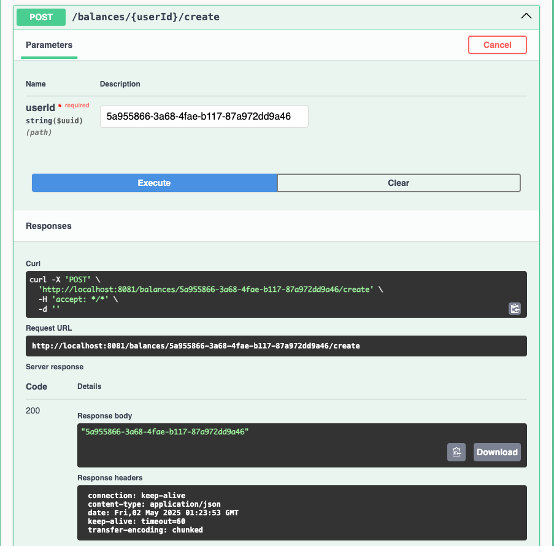

Все получилось! А теперь давайте добавим туда денег:

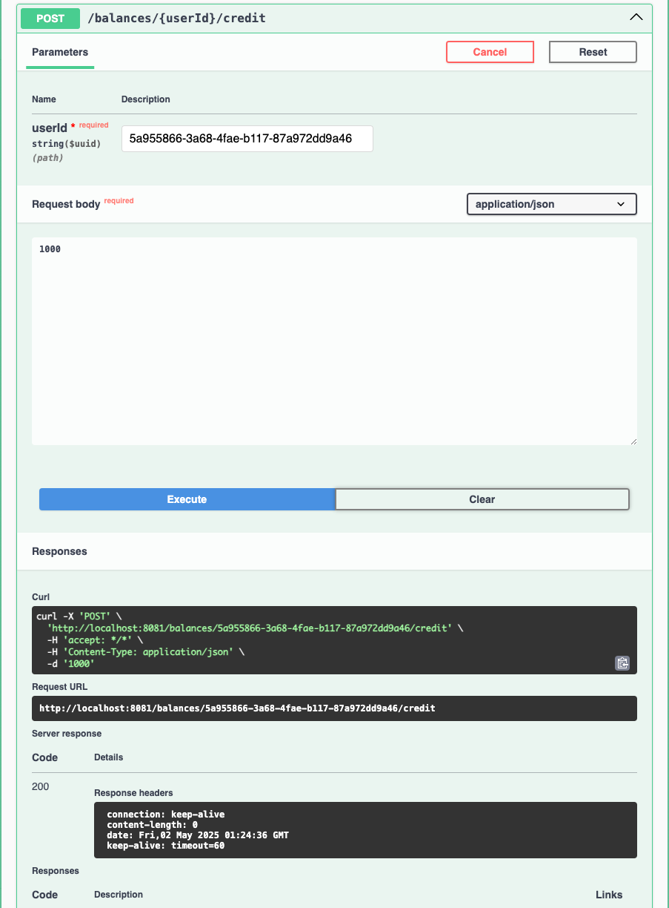

Запрос выполнился успешно. Теперь давайте снимем деньги несколькими транзакциями:

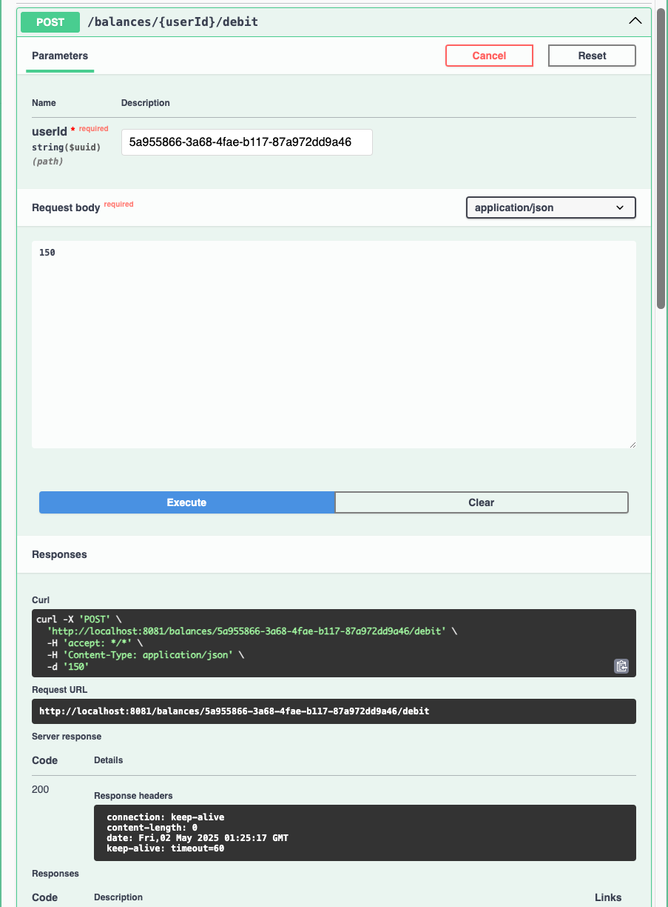


А теперь посмотрим итоговое состояние нашего баланса:

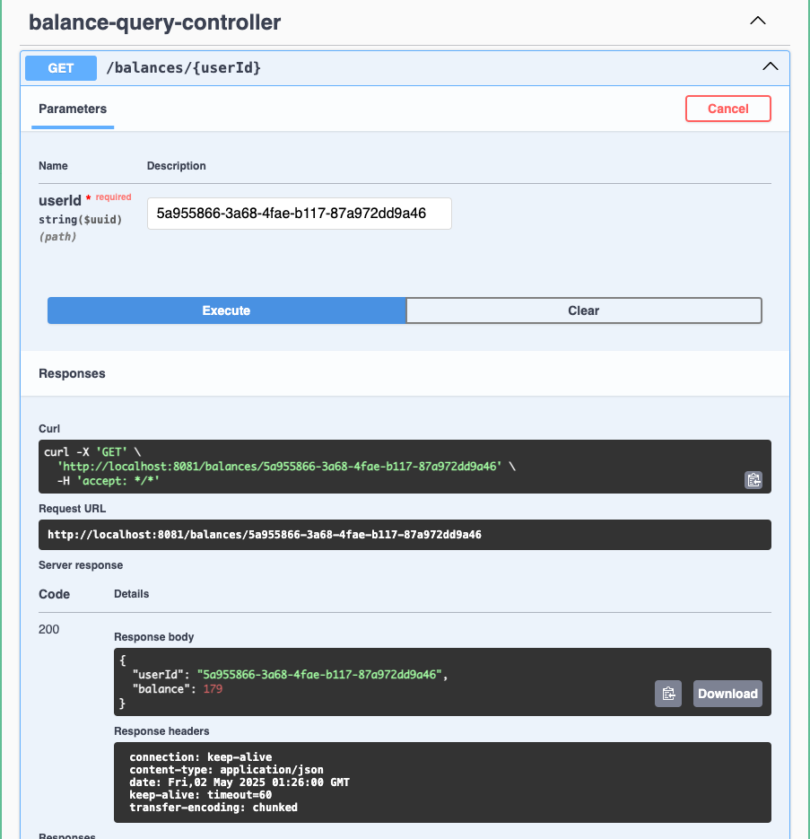

Видим, что read-модель корректно отображает итоговую сумму. Давайте проверим историю транзакций:

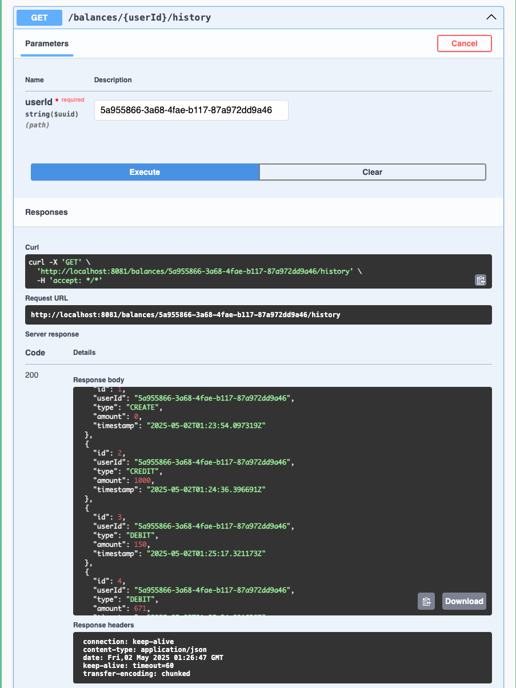

Получим в ответе ровно то, что и ожидали - полный список транзакций с суммой, типом и временем выполнения. Просто замечательно!

Если вдруг наши read-модели пропадут (база сотрется, еще что-то случится), то их состояние восстановится автоматически
после поднятия приложения через реплей (replay) событий - события просто еще раз пройдут через проекцию и все read-модели будут
восстановлены.

Давайте посмотрим, как в аксон сервере лежат события. Для этого перейдем обратно на `localhost:8024` и зайдем на вкладку поиска:

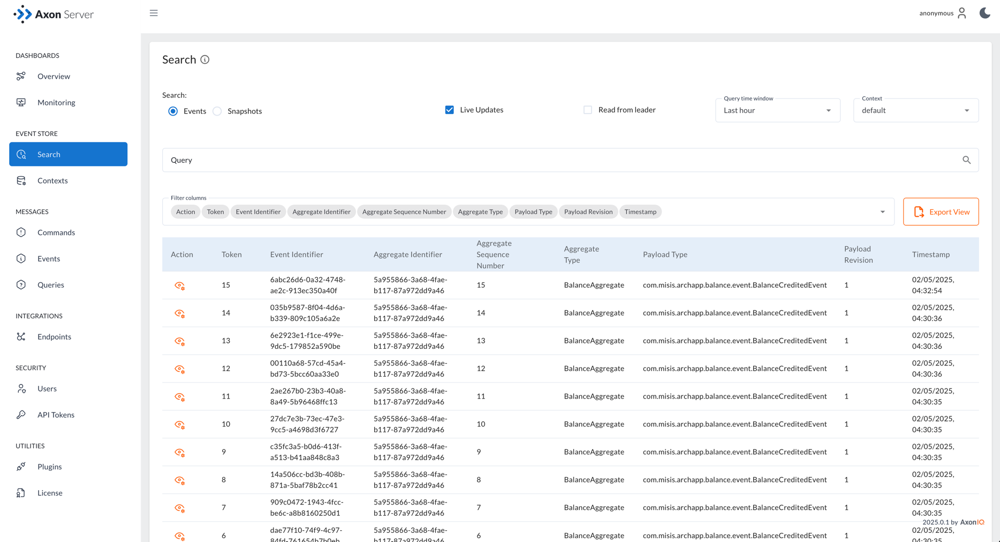

Видим что все события, которые произошли с нашим агрегатом, лежат на сервере. Именно из этих событий и восстанавливаются read-модели.

И вот получается, что мы с вами реализовали простой сервис для работы с балансом пользователя используя паттерны CQRS и Event Sourcing!
